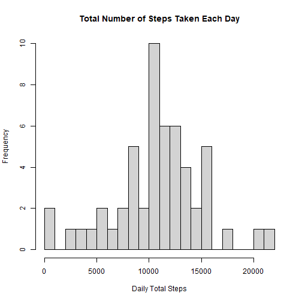
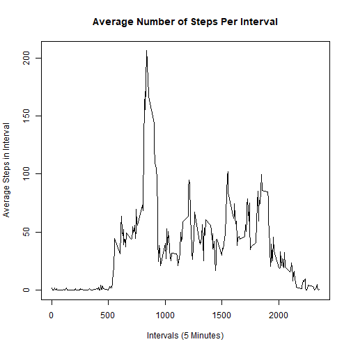
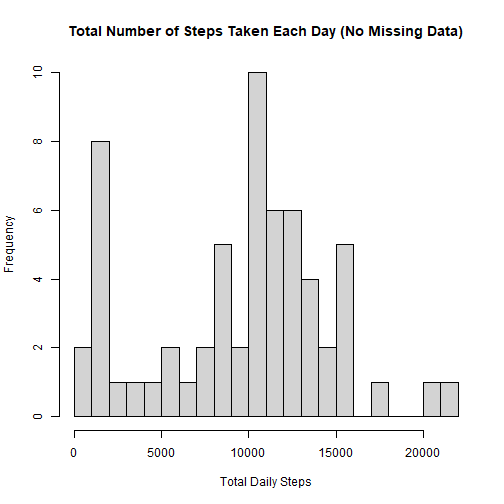
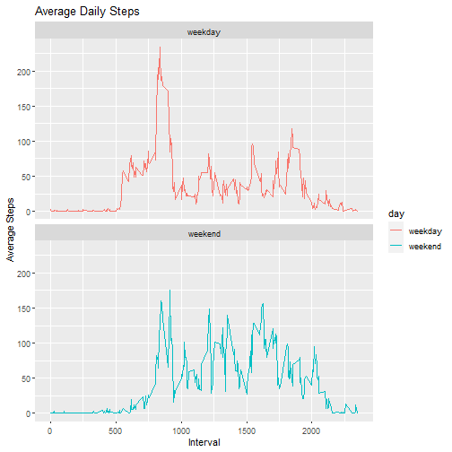

Reproducible Research Course Project 1
========================================================================

###Loading and preprocessing the data
Import csv, format date and remove NA steps rows:

```r
activity <- read.csv("activity.csv")
activity$date <- as.Date(strptime(activity$date, format="%Y-%m-%d"))
activity <- subset(activity, !is.na(activity$steps))
```

###What is mean total number of steps taken per day?
1. Calculate the total number of steps taken per day

```r
activity_steps <- aggregate(steps ~ date, activity, sum, na.rm=TRUE)
```
2. Make a histogram of the total number of steps taken each day

```r
hist(x = activity_steps$steps,
     xlab = "Daily Total Steps",
     main = "Total Number of Steps Taken Each Day",
     breaks = 30)
```



3. Calculate and report the mean and median of the total number of steps taken per day

```r
mean_steps <- mean(activity_steps$steps)
mean_steps
```

```
## [1] 10766.19
```


```r
median_steps <- median(activity_steps$steps)
median_steps
```

```
## [1] 10765
```

###What is the average daily activity pattern?
1. Make a time series plot of the 5-minute interval (x-axis) and the average number of steps taken, averaged across all days (y-axis)

```r
activity_5min <- aggregate(steps ~ interval, data=activity, mean, na.rm=TRUE)
plot(steps ~ interval,
     activity_5min,
     type="l",
     xlab="Intervals (5 Minutes)",
     ylab="Average Steps in Interval",
     main = "Average Number of Steps Per Interval")
```



2. Which 5-minute interval, on average across all the days in the dataset, contains the maximum number of steps?

```r
activity_5min_max <- activity_5min[which.max(activity_5min$steps),]$interval
activity_5min_max
```

```
## [1] 835
```

###Imputing missing values
1. Calculate and report the total number of missing values in the dataset

```r
activity2 <- read.csv("activity.csv")
sum(is.na(activity2$steps))
```

```
## [1] 2304
```
2. Devise a strategy for filling in all of the missing values in the dataset

```r
activity2_na <- is.na(activity2$steps)
interval_means <- tapply(activity$steps, activity$interval, mean, na.rm=TRUE, simplify=T)
activity2$steps[activity2_na] <- interval_means[as.numeric(activity2$interval[activity2_na])]
```

```
## Warning in activity2$steps[activity2_na] <- interval_means[as.numeric(activity2$interval[activity2_na])]: number of items to replace is not
## a multiple of replacement length
```
3. Create a new dataset that is equal to the original dataset but with the missing data filled in

```r
activity_nona <- tapply(activity2$steps, activity2$date, sum, na.rm=TRUE, simplify=T)
```
4. Make a histogram of the total number of steps taken each day and Calculate and report the mean and median total number of steps taken per day. 

```r
hist(x=activity_nona,
     xlab="Total Daily Steps",
     main="Total Number of Steps Taken Each Day (No Missing Data)",
     breaks=30)
```




```r
mean_steps <- mean(activity_nona)
mean_steps
```

```
## [1] 9544.637
```


```r
median_steps <- median(activity_nona)
median_steps
```

```
## [1] 10395
```

###Are there differences in activity patterns between weekdays and weekends?
1. Create a new factor variable in the dataset with two levels - "weekday" and "weekend" indicating whether a given date is a weekday or weekend day.

```r
rows_activity <- nrow(activity)
activity$day <- weekdays(activity$date)

for (i in 1:rows_activity) {
    if (activity[i,]$day %in% c("Saturday","Sunday")) {
        activity[i,]$day<-"weekend"
    }
    else{
        activity[i,]$day<-"weekday"
    }
}
```
2. Make a panel plot containing a time series plot of the 5-minute interval (x-axis) and the average number of steps taken, averaged across all weekday days or weekend days (y-axis). 

```r
activity_days <- aggregate(steps ~ interval + day, activity, mean, na.rm = TRUE)
library(ggplot2)
panel<- ggplot(activity_days, aes(x = interval , y = steps, color = day)) +
  geom_line() +
  facet_wrap(~day, ncol = 1, nrow=2) +
  labs(title = "Average Daily Steps", x = "Interval", y = "Average Steps")
print(panel)
```


